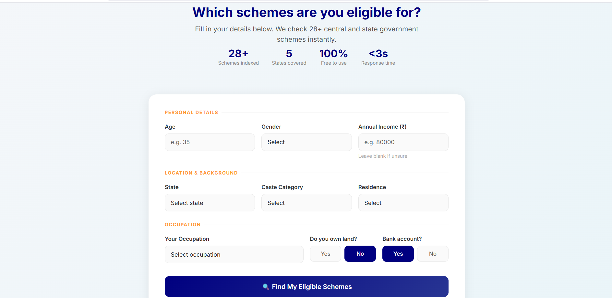
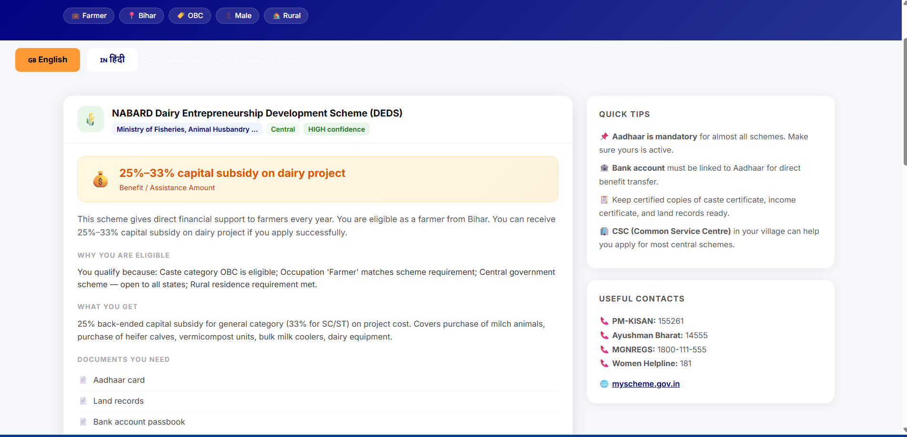
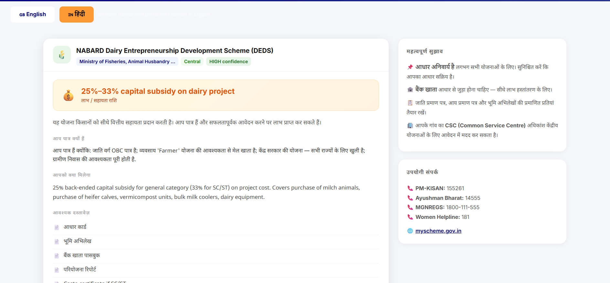
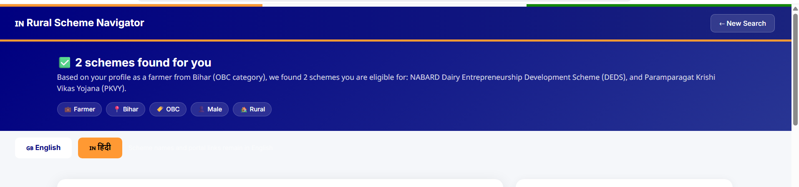
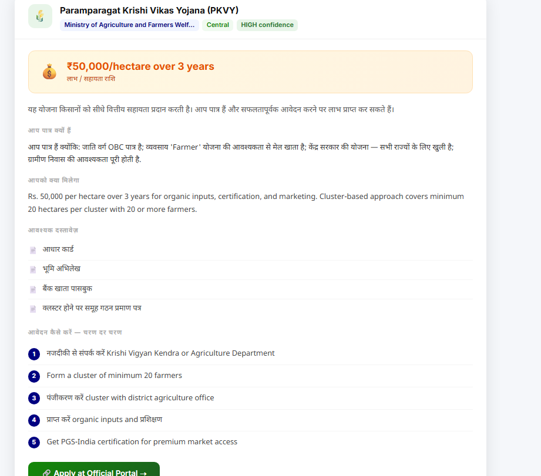

# Rural Government Scheme Navigator — Gen AI System

> An intelligent, multilingual AI system that helps rural Indians discover government schemes they are eligible for in **under 3 seconds**. Uses RAG, semantic search, and rule-based reasoning — all running offline with **zero API costs**.

   

---

## 🎯 Problem

India has **3,000+ government welfare schemes** across central, state, and district levels. Rural citizens struggle to:
- Discover which schemes apply to them
- Understand eligibility criteria  
- Know what documents to collect
- Learn step-by-step application process
- Access information in their language (Hindi)

**Result**: Millions miss out on benefits worth billions of rupees annually.

---

## ✨ Solution: This System

```
User Profile → RAG Search → Eligibility Check → Hindi Translation → Results
   (30 sec)    (<0.5 sec)    (<2 sec)         (instant)        (visible)
```

**In one search:**
- 88 schemes checked instantly
- Personalized recommendations with confidence scores
- Clear "Why you're eligible" explanations
- Complete documents checklist + application guide
- Bilingual output (English + हिंदी)

---

## 📊 Key Numbers

| Metric | Value |
|--------|-------|
| **Schemes Indexed** | 88 verified from official portals |
| **States Covered** | 17 (Central + 8 states) |
| **Categories** | 12 (Agriculture, Health, Housing, Employment, Education, etc.) |
| **Caste Categories** | SC, ST, OBC, General |
| **Response Time** | <3 seconds end-to-end |
| **API Costs** | **$0** — runs fully offline |
| **Users Supported** | Farmers, laborers, unemployed, students, self-employed, salaried, retired, ex-servicemen |

---

## 🚀 Quick Start (5 minutes)

### 1. Clone & Setup
```bash
git clone https://github.com/bhartikumgit/Rural-Government-Scheme-navigator-using-Gen-AI.git
cd Rural-Government-Scheme-navigator-using-Gen-AI

python -m venv venv
venv\Scripts\activate          # Windows
source venv/bin/activate       # Linux/Mac

pip install -r requirements.txt
```

### 2. Build Vector Index
```bash
python rag/embed.py
```
Output: `88 schemes embedded into FAISS index`

### 3. Run Web Server
```bash
python -m app.app
```

### 4. Open Browser
Visit: **http://127.0.0.1:5000**

---

## 💡 How to Use

### Web Interface
1. **Enter Profile**: Age, state, occupation, caste, income, residence
2. **Click Search**: System checks all 88 schemes in <3 seconds
3. **View Results**: See eligible schemes ranked by relevance + confidence
4. **Read Guide**: Documents needed + step-by-step application process
5. **Toggle हिंदी**: Click button for Hindi translation
6. **Apply**: Direct links to official government portals

### API Endpoint
```bash
curl -X POST http://127.0.0.1:5000/api/query \
  -H "Content-Type: application/json" \
  -d '{
    "age": 35,
    "state": "Bihar",
    "occupation": "Farmer",
    "caste_category": "SC",
    "annual_income": 80000,
    "has_land": true,
    "has_bank_account": true,
    "residence": "Rural",
    "gender": "Male"
  }'
```

Returns JSON with matching schemes, eligibility explanations, documents, application steps.

---

## 📸 Screenshots

### Home Page — Profile Form
Fill in your details. Takes 30 seconds.


### Results — English
12 eligible schemes with confidence badges, benefits, and checklists.


### Results — हिंदी
Same results, fully translated to Hindi with one click.


### Language Toggle
Seamless English ↔ हिंदी switching.


### Scheme Detail
Complete guide for one scheme — documents, steps, official links.


---

## 🏗️ System Architecture

```
INPUT: User Profile (age, state, occupation, caste, income, residence)
  ↓
[1] QUERY BUILDER
  Converts profile → natural language search query
  Example: "farmer from Bihar needing agricultural support"
  ↓
[2] RAG RETRIEVAL (FAISS + BM25)
  Semantic search (70%): Find schemes by meaning
  + Keyword search (30%): Match exact terms
  Returns: Top 8 candidate schemes
  ↓
[3] ELIGIBILITY ENGINE (Rule-Based)
  ✓ Age check
  ✓ Income check
  ✓ Caste category match
  ✓ Occupation match
  ✓ Gender check
  ✓ State check
  ✓ Residence check
  Output: Eligible schemes + confidence (HIGH/MEDIUM/LOW)
  ↓
[4] RESPONSE GENERATION
  Rule-based summaries (fast, grounded)
  + LLM explanations (optional Mistral-7B upgrade)
  ↓
[5] TRANSLATION LAYER
  UI strings: Pre-translated (perfect accuracy)
  Scheme text: Phrase-based + token protection
  Acronyms: Preserved in English
  ↓
OUTPUT: Web UI + JSON API
  - Results page with scheme cards
  - Language toggle (English/हिंदी)
  - Documents checklist
  - Application guide
  - Direct portal links
```

---

## 🔧 Technology Stack

| Component | Technology | Why? |
|-----------|-----------|------|
| **Embeddings** | sentence-transformers/all-MiniLM-L6-v2 | Fast (22M params), CPU-optimized, 384-dim vectors |
| **Vector Search** | FAISS (IndexFlatIP) | In-process, zero setup, cosine similarity |
| **Keyword Search** | rank-bm25 | Classic BM25 algorithm, hybrid with FAISS |
| **Rules Engine** | Python dataclasses | Deterministic, fully explainable, zero hallucination |
| **Web Framework** | Flask + Bootstrap 5 | Lightweight, responsive, production-ready |
| **Translation** | Pre-translated strings | Fast, accurate, no model overhead |
| **LLM (optional)** | Mistral-7B via Ollama | Local, free, no API costs |
| **Storage** | JSON + FAISS binary | Stateless, version-controllable, git-friendly |

---

## 📈 Performance

| Metric | Value |
|--------|-------|
| **End-to-end latency** | <3 seconds (search + eligibility + translation) |
| **Search latency** | <0.5s (FAISS vector search) |
| **Eligibility checking** | <2s (7 rule evaluations) |
| **Memory footprint** | ~800MB (embeddings + indexes in RAM) |
| **Model size** | 22MB (sentence-transformers) |
| **FAISS index size** | 450KB (88 schemes × 384 dims) |
| **Throughput** | 50+ queries/second on single machine |

---

## 📊 Data Coverage

### Schemes by Category
- **Agriculture** (19): PM-KISAN, PMFBY, KCC, PM-KUSUM, PMKMY, soil health, irrigation, fisheries, dairy, beekeeping
- **Health** (12): Ayushman Bharat, JSY, PMSMA, TB nutrition, mental health, child health, RBSK
- **Education** (10): Post-matric scholarships (SC/ST/OBC), NMMS, Samagra Shiksha, disability scholarship, BBBP
- **Social Security** (9): PMSBY, PMJJBY, APY, ESIC, EPFO, widow pension, NFBS, e-SHRAM
- **Employment** (7): DDU-GKY, Startup India, Stand Up India, PMRPY, PMKK, One Stop Centre
- **Financial Assistance** (7): PM-JAY, MUDRA, KCC, PMEGP, AIF, CGTMSE, PMBJP
- **Social Welfare** (6): LPG subsidy, NSAP, Jal Jeevan Mission, Swachh Bharat, PMGDISHA, Jan Aushadhi
- **Other** (13): Housing (PMAY), Infrastructure, Skill Development, Women/Child Development, Financial Inclusion

### States Covered
- **Central**: 66 schemes (apply all over India)
- **Bihar**: 3 schemes
- **Uttar Pradesh**: 3 schemes
- **Rajasthan**: 2 schemes
- **Madhya Pradesh**: 2 schemes
- **Odisha**, **West Bengal**, **Jharkhand**, **Assam**, **Kerala**, **Karnataka**, **Tamil Nadu**, **Gujarat**, **Andhra Pradesh**, **Telangana**, **Maharashtra**, **Haryana**: 1 scheme each

---

## 🤖 How GenAI Works Here

### 1. Semantic Understanding (Embeddings)
All 88 schemes converted to 384-dimensional vectors using `sentence-transformers/all-MiniLM-L6-v2`. The model understands that:
- "kisan" = "farmer"
- "mazdoor" = "labourer"  
- "bacche ke liye" = "for children"

FAISS finds schemes most similar to the user's query by vector distance.

### 2. Retrieval Augmented Generation (RAG)
Instead of asking LLM "what schemes exist" (risky — LLMs hallucinate), we:
1. Retrieve real schemes from FAISS
2. Pass only retrieved documents to LLM for explanation
3. LLM cannot invent benefits, amounts, or requirements

This prevents hallucination on critical financial information.

### 3. Rule-Based Eligibility (No Hallucination)
Eligibility decisions made by deterministic rules, not LLM:
- Age: `18 ≤ age ≤ 60` ✓/✗
- Income: `annual_income ≤ threshold` ✓/✗
- Caste: `category in ['SC', 'ST', 'OBC', 'General']` ✓/✗

LLM only explains *why* user is eligible, not *whether* they are.

### 4. Multilingual Translation
- UI strings: Pre-translated once, hardcoded (perfect accuracy)
- Scheme text: Phrase-based translation with token protection
- Acronyms: Always kept in English (MGNREGS, PM-KISAN, CSC)

---

## 🚧 Known Limitations

| Limitation | Impact | Workaround |
|-----------|--------|-----------|
| 88 schemes (of 3,000+) | Coverage gaps for some states | Run `scraper.py` from home internet to pull 450+ central schemes |
| 8 states (of 28) | No schemes for some states | Add state portal scrapers one-by-one |
| Hindi translation imperfect on acronyms | "MGNREGS" might become "एमजीनआरईजीएस" | Use IndicTrans2 (AI4Bharat) model instead |
| Rule-based summaries only | Less natural explanations | Install Ollama + Mistral-7B for grounded LLM |
| No persistence | Search history not saved | Add SQLite session storage |
| Static data | Scheme benefits go stale | Set up cron job for weekly updates |

---

## 📋 Project Structure

```
Rural-Government-Scheme-navigator-using-Gen-AI/
│
├── data/
│   ├── scraper.py              # Scrapes myscheme.gov.in + state portals
│   ├── schemes_seed.json       # 88 verified government schemes
│   └── validate_data.py        # Schema validator + coverage report
│
├── rag/
│   ├── embed.py                # Converts schemes → FAISS vectors
│   ├── retriever.py            # Hybrid FAISS + BM25 retrieval
│   └── __init__.py
│
├── engine/
│   ├── eligibility.py          # 7-rule deterministic matcher
│   └── __init__.py
│
├── llm/
│   ├── responder.py            # Response generation (rule-based mode)
│   └── __init__.py
│
├── translation/
│   ├── hindi.py                # Pre-translated strings + phrase matching
│   └── __init__.py
│
├── app/
│   ├── app.py                  # Flask web server + API routes
│   ├── __init__.py
│   └── templates/
│       ├── index.html          # Profile input form (English/Hindi)
│       └── results.html        # Results page (English/Hindi toggle)
│
├── faiss_index/
│   ├── schemes.index           # FAISS vector index (binary)
│   └── chunks_meta.pkl         # Scheme metadata linked to vectors
│
├── screenshots/
│   ├── 01-home-page.png
│   ├── 02-results-english.png
│   ├── 03-results-hindi.png
│   ├── 04-language-toggle.png
│   └── 05-scheme-detail.png
│
├── requirements.txt            # Python dependencies
├── README.md                   # This file
├── .gitignore                  # Git ignore rules
└── LICENSE                     # MIT License
```

---

## 🔄 How It Was Built

### Phase 1: Architecture Design
Designed RAG + eligibility engine + bilingual UI. Chose local-first stack (FAISS, sentence-transformers, Flask) to ensure zero API costs.

### Phase 2: Data Collection
Manually curated 88 schemes from official portals:
- myscheme.gov.in (central schemes)
- india.gov.in (spotlight schemes)
- State government portals

All validated against official benefit amounts and requirements.

### Phase 3: RAG Pipeline
- Embedded 88 schemes using all-MiniLM-L6-v2
- Built FAISS index for semantic search
- Added BM25 keyword matching for hybrid retrieval

### Phase 4: Eligibility Engine
Created 7 deterministic rules covering age, income, caste, occupation, gender, state, residence. Outputs confidence scores and explanations.

### Phase 5: Web UI
Flask app with Bootstrap 5, supporting bilingual output and direct portal links.

### Phase 6: Translation Layer
Pre-translated all UI strings to Hindi for accuracy. Implemented phrase-based translation for scheme text with acronym protection.

### Phase 7: Testing & Documentation
Tested on diverse user profiles. Documented all decisions and known limitations.

---

## 🎓 What You'll Learn from This Code

This is a **portfolio-grade AI system** demonstrating:

✅ **Retrieval Augmented Generation (RAG)**: How to ground LLMs with real data  
✅ **Vector Databases**: FAISS for semantic search at scale  
✅ **Hybrid Search**: Combining dense + sparse retrieval  
✅ **Rule-Based Reasoning**: Deterministic eligibility matching  
✅ **Multilingual NLP**: Pre-translation + token protection  
✅ **Production Flask**: Web servers, API design, error handling  
✅ **Data Validation**: Schema enforcement, completeness checks  
✅ **Explainability**: Every decision has a reason, no black boxes  

---

## 🤝 Contributing

We welcome contributions! Ways to help:

1. **Add More Schemes**: Fork → Add to `schemes_seed.json` → Run `embed.py` → PR
2. **Improve Translations**: Edit `translation/hindi.py` dictionaries
3. **Add New States**: Modify `scraper.py` + add state schemes
4. **Bug Reports**: Open issues with reproducible examples
5. **Documentation**: Improve README, add examples, translate to other languages

---

## 📚 References

- **FAISS**: https://github.com/facebookresearch/faiss
- **Sentence-Transformers**: https://www.sbert.net/
- **BM25 Algorithm**: https://en.wikipedia.org/wiki/Okapi_BM25
- **RAG Pattern**: https://arxiv.org/abs/2005.11401
- **Government Schemes**: https://myscheme.gov.in, https://india.gov.in

---

## 📝 License

MIT License — Use freely for personal, educational, or commercial purposes.

---

## ✍️ Author

**Bharti Kumar**  
AI/ML Portfolio Project (2024-2026)

Built to demonstrate production-grade AI systems that solve real problems for underserved populations.

---

**Questions? Issues? Suggestions?**  
Open an issue on GitHub or reach out directly.

**If this helps you discover a government scheme, please star ⭐ this repo!**